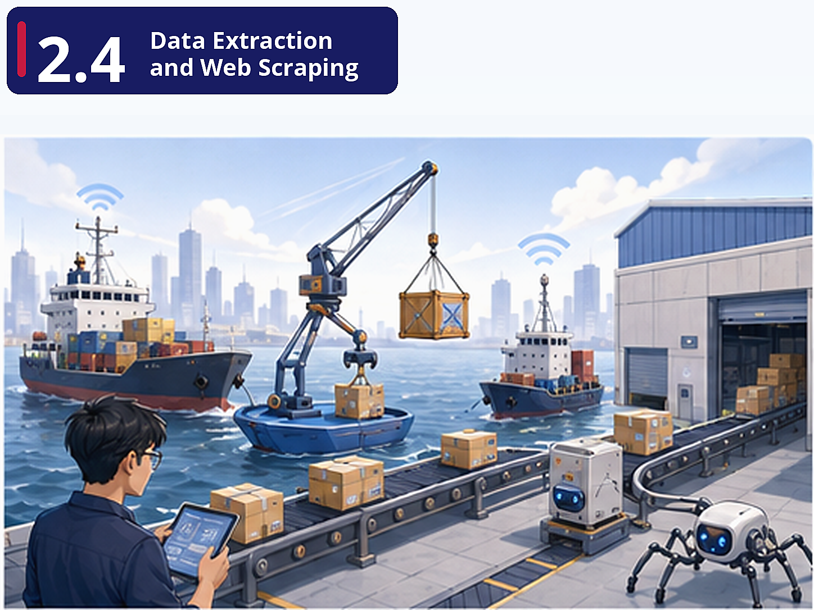

# Pre-class Brief

## Where are we?

Now you need to actually *get* data into FreshCart's platform. The logistics partner has a REST API. GitHub (your internal code platform) has a GraphQL API. Competitor pricing data isn't available via any API — you'll need to scrape it from their public website. This unit is where you get your hands dirty with the "Extract" part of ELT.

## Why this matters

A data engineer's first job is almost always "get data from Point A to Point B." APIs are the standard interface for system-to-system data exchange, and knowing how to authenticate, paginate, handle rate limits, and parse responses is a daily skill. Web scraping fills the gap when no API exists — but comes with ethical and legal considerations.

## Key concepts

**REST API Mechanics** — Not just "how to call an API" but how to call one *reliably*. Understanding Bearer token authentication, handling 4xx/5xx errors gracefully, and paginating through large result sets are the difference between a script that works once and a pipeline that works in production.

**REST vs GraphQL Trade-offs** — REST returns fixed response shapes (often over-fetching data you don't need). GraphQL lets you specify exactly what fields you want. For FreshCart, if you only need `order_id` and `status` from a 50-field order object, GraphQL saves bandwidth and processing.

**Web Scraping Fundamentals** — HTML structure, CSS selectors, BeautifulSoup. Scraped data is fragile (the website can change at any time), may be legally restricted, and is often messy. This is a useful skill but should be treated as a last resort after APIs.
